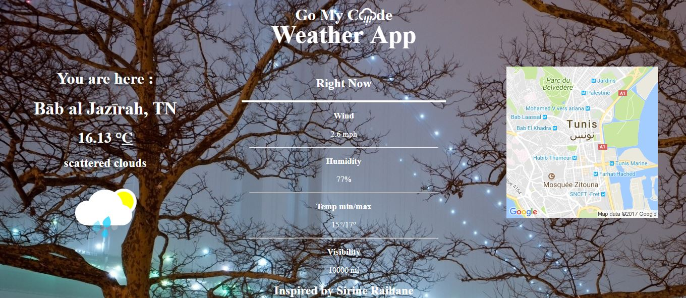

# Mini local weather App

In this mini-project I have developed a small weather web application that shows the local weather in your position, as part of my full stack JavaScript training offered by [GOMYCODE Tunisia](https://www.gomycode.tn)

## Project brief

This is a small web application wich does the following:

* Build a CodePen.io app that is funcionally similar to this [APP](http://codepen.io/FreeCodeCamp/full/bELRjV) .

* Use whichever libraries or APIs we need. Give it my own personal style.

* I can see the weather in my current location.

* I can see a different icon or background image (e.g. snow mountain, hot desert) depending on the weather.

* I can push a button to toggle between Fahrenheit and Celsius.

* I can see a loading spinner while the application is loading the weather data.

*add a small google map to your application. [Thid demo](https://developer.mozilla.org/en-US/docs/Web/API/Geolocation/Using_geolocation) could be helpful

	

## What I have learned

* Using `@media screen and` to change css under a condition.

* Use many API like geolocation api.

* Manipulate the response of Ajax call using jQuery.

* Devide the JS code into small functions that do one thing.
